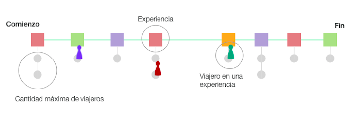

### FIT - Universidad Católica del Uruguay

 

# Examen Programación II - Julio 2021.1

«La ruta de _Tokaido_, que data del siglo XI, conecta las dos cuidades más importantes de Japón: Edo (hoy llamada Tokio) y Kyoto. [...] Tiene 500km de largo y sigue la costa sur de la isla más grande del archipiélago Japonés: Honshu.»

_Tokaido_ es, además de una ruta en Japón, un juego de mesa muy popular creado por Antoine Bauza. En el juego, viajeros de distintos orígenes atravisan el camino de Edo a Kyoto participando de diversas experiencias en el afán de enriqueser su viaje lo más posible.

## Referencia gráfica

La siguiente imágen ilustra la versión simplificada del juego descrito.

# Entregables

## Parte 1: Diagrama de clases

Construír el diagrama de clases que permita representar los objetos del modelo del juego descrito.

## Parte 2: Proyecto C# del modelo del juego

Construir en un proyecto de C# el modelo del juego diagramado en la parte anterior. Debe implementarse la lógica que permita corroborar que el modelo se comporta acorde a las reglas del juego descritas.

**No es necesario implementar un juego funcional, jugable por consola u otra interfaz de usuario.**. 

Sí es necesario representar todos los elementos del juego con sus restricciones y lógica de puntos, monedas, movimiento, condición de finalización y cálculo del ganador.

**Tampoco es necesario implementar un proyecto Program que simule el juego**.

Recuerda justificar mediante comentarios en el código los principios y patrones que utilizas y las desiciones de diseño que has tomado durante el proceso.

## Parte 3: Pruebas del modelo

Construír un proyecto de test que permite verificar que el modelo implementado cumple con las reglas del juego descritas.

## Entrega

La entrega se hará por WebAsignatura en la siguiente tarea: https://webasignatura.ucu.edu.uy/mod/assign/view.php?id=372778

Fecha límite: Miércoles 04 de Agosto a las 23:59. No se aceptarán entregas fuera de fecha.

Se deberá entrega un link a un repositorio con la solución, incluyendo todos los entregables mencionados. El repositorio debe tener acceso público.

--------------------------------------------------------------------------------------------------------------------------
--------------------------------------------------------------------------------------------------------------------------

## ACLARACIONES Y COMENTARIOS SOBRE EL FUNCIONAMIENTO

Solo los paisajes:
-Dan puntos directamente
-Tienen capacidad para dos viajeros

Las experiencias que no son paisajes:
-Otorgan monedas o bonos que luego se calcula su equivalencia en puntos
-Tienen capacidad para un solo viajero

El bono por pasar por AguasTermales:
-Si la cantidad de visitas es par la cantidad de bonos es igual a la cantidad de de visitas a AguasTermales dividido 2.
-Si la cant de visitas es 1 no se otorgan bonos. 
-Si la cantidad de visitas es impar la cantidad de bonos será igual a la cantidad de visitas menos 1 y luego dividido 2. 

Cada vez que se visita una granja se le suma una cantidad de monedas que corresponde a multiplicar la cantidad de visitas a una granja, por 2.

Los viajeros se mueven a una posicion dada randómicamente.

Cuando dos viajeros se encuentran en la última posición se mueve el primero que encuentra el programa, sin importar cuál llegó en primer lugar, luego se va a mover el que queda dado es el que sigue en la última posición. 

--------------------------------------------------------------------------------------------------------------------------
--------------------------------------------------------------------------------------------------------------------------